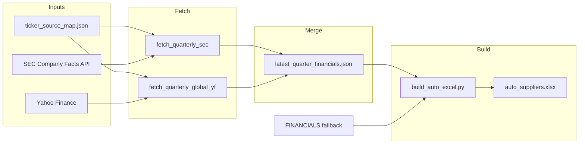

# Pipeline Overview

## Data flow

The pipeline fetches quarterly financials from two sources, merges them, then builds an Excel workbook.

1. **Fetch (US):** `fetch_quarterly_sec.py` reads `ticker_source_map.json` for companies with `data_source: "US"`, maps tickers to CIKs, and pulls Company Facts from SEC EDGAR. It extracts the latest quarter (preferring 2025/2026) for Revenue, SG&A, and Operating Income.

2. **Fetch (global):** `fetch_quarterly_global_yf.py` uses the same ticker map (and a fixed list for Canada/Europe/Korea) to fetch quarterly income via Yahoo Finance. Figures are converted to USD using FX pairs or fallback rates.

3. **Merge:** `fetch_all_quarterly.py` merges global first, then US. **US overwrites when the same company key exists in both.** Optional `quarterly_overrides.json` can fill gaps for names with no SEC or Yahoo data.

4. **Build:** `build_auto_excel.py` reads `latest_quarter_financials.json`. For each company in `INCLUDE_DETAILS`, it uses the JSON row when present; otherwise it falls back to the embedded **FINANCIALS** dict (annual data). It then writes the 5-sheet workbook.

## FINANCIALS vs quarterly JSON

- **Quarterly JSON:** Preferred. Contains latest quarter (e.g. Q4 2025, Q1 2026) from SEC or Yahoo Finance.
- **FINANCIALS:** Fallback when the JSON file is missing or the company is not in the JSON. Tuple format: `(revenue_usd, sga_usd, ebit_usd, fiscal_year, source_note)`.

Company keys must match exactly between `ticker_source_map.json`, the JSON, and `build_auto_excel.py` (INCLUDE_DETAILS / FINANCIALS).
